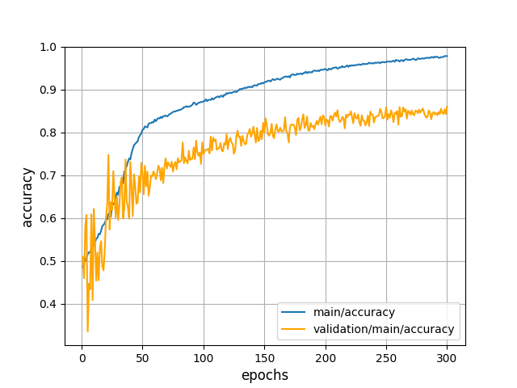

## Knowledge graph integration

### 1. Motivation

- Problem
  - Sharing of entities in different KBs

- After integration
  - Information redundancy elimination
  - Integration to larger Knowledge graph
  - Completion of one KB with another KB

### 2. Tasks & Methods 

#### 2.1 Task Definition

##### 1) Dataset Definition

Condition : Two knowledge graphs -> sub-graph

Goal : Integration knowledge graphs -> complete graph

###### Notations 

- Entity set:

  $$\mathcal{E}=\mathcal{E}_1\cup\mathcal{E}_2\cup\mathcal{E}_s$$

- Sub-graph1:

  $$\mathcal{G1} : {(e_i^{h1},r_i^1,e_i^{t1})|e_i^{h1},e_i^{t1}\in\mathcal{E_1}\cup\mathcal{E}_s, r_i^1\in\mathcal{R_1}}$$

- Sub-graph2:

  $$\mathcal{G2} : {(e_i^{h2},r_i^2,e_i^{t2})|e_i^{h2},e_i^{t2}\in\mathcal{E_2}\cup\mathcal{E}_s, r_i^2\in\mathcal{R_2}}$$

- Complete Graph:

  $$\mathcal{G} : \{(e_i^h,r_i,e_i^t)|e_i^h,e_i^t\in\mathcal{E}, r_i\in\mathcal{R}\}$$

- Train/Test Division:

  $$\mathcal{E}_1=\mathcal{E}_1^{train}\cup\mathcal{E}_1^{test}$$

  $$\mathcal{E}_2=\mathcal{E}_2^{train}\cup\mathcal{E}_2^{test}$$

  $$\mathcal{E}_s=\mathcal{E}_s^{train}\cup\mathcal{E}_s^{test}$$

- Problem setting

  - $\mathcal{E}_1^{train}, \mathcal{E}_2^{train}, \mathcal{E}_s^{train}$ And
    $\mathcal{E}_1^{test}\cup\mathcal{E}_s^{test},\mathcal{E}_2^{test}\cup\mathcal{E}_s^{test}$ is known
  - $\mathcal{G1}, \mathcal{G2}$ is known
  - $\mathcal{E}_1^{test}, \mathcal{E}_2^{test}, \mathcal{E}_s^{test}$ is unknown

- Task
  Identifying elements in $\mathcal{E}_1^{test}, \mathcal{E}_2^{test}, \mathcal{E}_s^{test}$

###### Model

  $$\theta = \arg\max_{\theta} (P(e_1^i, e_2^i, c^i)| \mathcal{G1}, \mathcal{G2}, \theta)$$

  $$  c^i =\begin{cases}1,  & \text{if  $e_1^i=e_2^i$ and } e_1^i \in \mathcal{E}_1\cup\mathcal{E}_s, e_2^i \in \mathcal{E}_2\cup\mathcal{E}_s\\\\0, & \text{else}\end{cases}$$

#### 2.2 Dataset Collection

- Sampling two sub-graphs from FB15K

- Sampling hyper-parameter:
  - Sampling methods : next section
  - Overlap rate:

    $$\frac{|\mathcal{E}_s|}{(|\mathcal{E}_s|+|\mathcal{E}_1|)}$$

  - Train rate:

    $$\frac{|\mathcal{E}_s^{train}|+|\mathcal{E}_1^{train}|}{(|\mathcal{E}_s|+|\mathcal{E}_1|)}$$

- All the experiment introduced below is based on this dataset

Venn graph

##### 2.2.2 - Real dataset

- Three basic parts
  - FB15K 	(13583 entities 592213 triples)
  - DBpedia (crawl online)
  - DBs-FBs -> download available

- Crawled DBpedia
  - only entities in FB15K
    - without 'wikiPage'-link : (12730 entities 112391 triples) -> using
    - with    'wikiPage'-link : (13934 entities 685392 triples)
  - one more layer connect to entities in FB15K
    - with 'wikiPage'-link : (6411218 entities 38597471 triples)
    - without 'wikiPage'-link : (4349425 entities 12787660 triples)

- After mapping
  - 15580 DB items
  - 13499 FB items (13583 in raw FB15K)

- Examples:

- Properties:
  - One-to-many mapping relation between two datasets
  - Overlap rate

- Overlap
  - DB, FB -> convert to undirected graph
  - Adjacency matrix:
    - FB matrix : $\mathcal{M}_f$
    - DB matrix :  $\mathcal{M}_d$
    - Overlap matrix : $\mathcal{M}_d = \mathcal{M}_f \& \mathcal{M}_d$
    - All matrix : $\mathcal{M}_a = \mathcal{M}_f + \mathcal{M}_d$

- Result:
  - overlap / DB = sum($\mathcal{M}_o$) / sum($\mathcal{M}_d$) = 0.614
  - overlap / FB = sum($\mathcal{M}_o$) / sum($\mathcal{M}_f$) = 0.063
  - overlap / all = sum($\mathcal{M}_o$) / sum($\mathcal{M}_a$) = 0.114

- Graph Sampling
- Knowledge Base Integration

#### 2.3 Graph Sampling

- Make dummy data
  - Sampling of three parts form set of all nodes
  - Sample $\ \mathcal{E}_1, \mathcal{E}_2, \mathcal{E}_s\ $ from $\ \mathcal{E}$

Venn graph

- Analysis the effect by dataset to task

###### 2.3.2 Two sampling Methods

- Uniform random Sampling
- Neighborhood Sampling

###### 2.3.3 Different properties

- Graph generated by different sampling method have different properties
  - Exponent characterizing the distribution by zipf law
  - Density
- Zipf Exponent
  - Raw graph : 0.47
  - Uniform sampling sub-graph : 0.50
  - Neighborhood sub-graph : 0.59

  
  
  

- Density :
  - $d = \\frac{m}{n(n-1)}$
  - where n is the number of nodes and m is the number of edges in G
  - Result :
    - Raw graph : 0.00221
    - Uniform sampling sub-graph : 0.00229
    - Neighborhood sub-graph : 0.0016

#### 2.4 Knowledge base integration

##### 2.4.1 Pipeline Model

- Pipeline Model : TransE + Classification neural network
  - Idea : Mapping between two embedding spaces
  - Weakness : Incremental pipeline model - Increasing error

- Classification neural network
  - Non-concatenated
  - Concatenated
  - Half-Concatenated

- Non-concatenated NN

- Concatenated NN

  - Forward:

    

  - Backward:

  
  ​

- Half-concatenated NN - forward
  - Half parameter of transpose matrix is static

    - Forward:

      

    - Backward:

    

- Result - Concat VS Half-Concat VS Non-Concat

​    

- Multi-layers models

  - Model:

    

  - Results:

    

    

##### 2.4.2 Joint Model

###### Model

- Train embeddings - **TransE**

- Use entity embedding as **pre-trained embeddings**

- Information update with graph neural network **Edge-static neural networks**

- **Classification** with Shallow neural network

  

  ###### Results

  - Failed : **Overfitting**
        

    
    ​